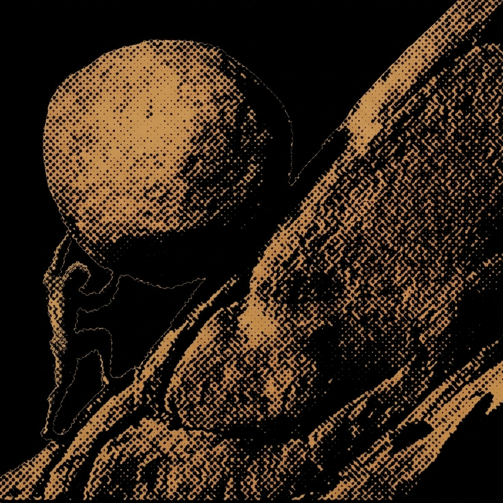

  <h2>Know About Me</h2>

Hey, I'm Faith.

I'm a CS student, and honestly, I spend most of my time just learning and tweaking with systems. I like getting into the nitty gritties and, messing around. I am a huge fan of Fabrice Bellard, so I am gradually carrying his fire of building tools from scratch to figure out how they actually work.

I code and touch grass, unlike some people... No comments.
        
I am aware of my massive skill issue duh... but I mean it's not that bad to write bad software nowadays anyways, so well!!? BUT I do build cool stuff (still building but you get the point.... xd). I love chess, music and gaming as well, nah! forget about my elo. 

Location: Buea, Cameroon, yes you! I know you haven't seen a mountain yet, talk less touch mountain grass. I do not mind you visiting I am very welly welcoming.

 

<table border="0">
  <tr>
    <td width="70%" valign="top">
      <h3>Some stuff I built / building</h3>
      

        
        Android VPN client routing traffic through SSH, Hysteria, and DNSTT to bypass network blocks.
      

      

        
        QEMU-based nested virtualization tool. Died a natural death.
      

      

        
        Android local VPN using QUIC to kill TCP head-of-line blocking and boost 3G throughput.
      

      

        
        Encrypted C proxy tunnel using AES-256-GCM and HTTP header camouflage to dodge DPI.
      

    </td>
    <td width="30%" align="center" valign="middle">
      
    </td>
  </tr>
</table>

Got a lot more scheduled. Just keep spying on here, pretty cool stuff dropping soon.

  <h2>Let's Talk</h2>
  

    
  

> "Simplicity is the ultimate sophistication." 
— Leonardo

